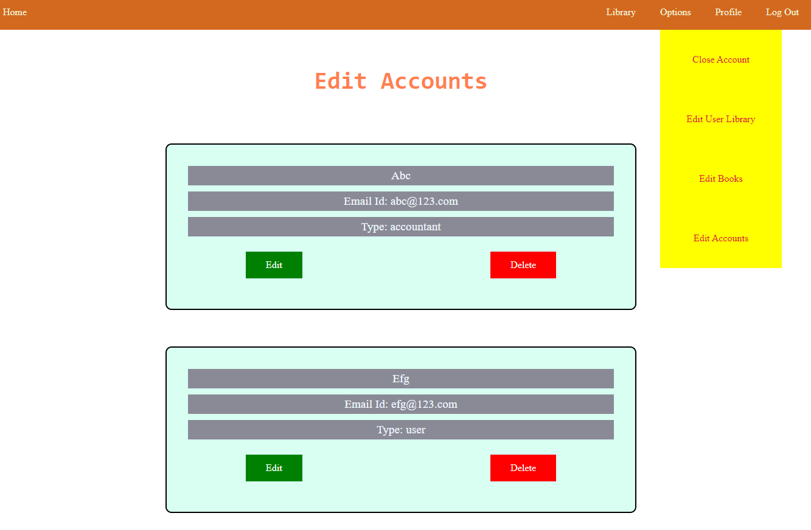
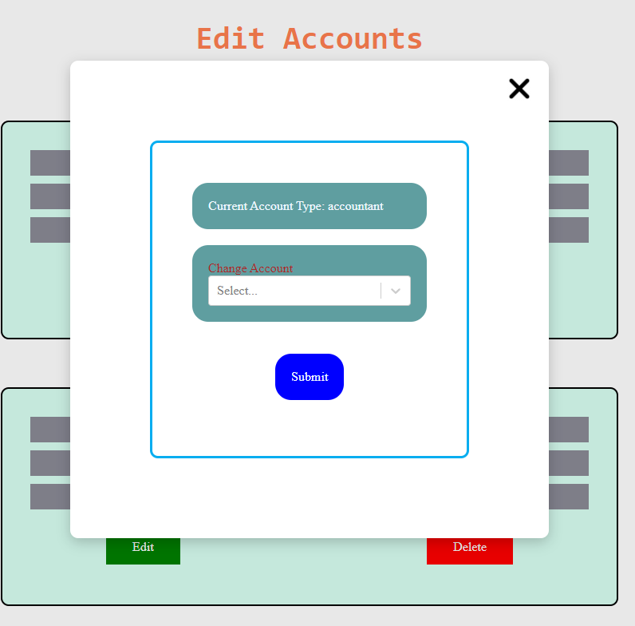

# Library Management App

It's a basic ReactJS library management app to manage books to demonstrate the access level of different users. It also includes features to view edit and manage books inventory.

This is a Multi-Page SPA made using React-Router.
Currently there is no backend and the app is using data stored in REDUX store.

## Run Locally

Clone the project

```bash
  git clone https://github.com/rupamdebnath627/library-management-app.git
```

Go to the project directory

```bash
  cd library-management-app
```

Install dependencies

```bash
  npm install
```

Start the server

```bash
  npm run dev
```

## Usage

To test functionality of the app:

First login into the app -> 'localhost:8000/login'.
-- Use account for login from "/docs/accounts.txt"
-- say "lmn@123.com"
-- password is not checked, so you can put anything


Next go to the 'Options' dropdown and select 'Edit Accounts'.
-- Since this an admin account, hence all four options are visible, other type of user will have less options.
-- Click on 'Delete' to delete user or 'Edit' for edit access of any user.



Here, select the option which you want to assign to the user.



## Tech Stack

**Client:** React, Vite, Redux, React-Router
